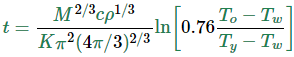

# Programas Simples
___

## Huevos a la copa

### Planteamiento
Cuando un huevo es hervido en agua, las proteínas comienzan a coagularse cuando la temperatura sobrepasa un punto crítico. A medida que la temperatura aumenta, las reacciones se aceleran.

En la clara, las proteínas comienzan a coagularse para temperaturas sobre 63°C, mientras que en la yema lo hacen para temperaturas sobre 70°C. Para hacer un huevo a la copa, la clara debe haber sido calentada lo suficiente para coagularse a más de 63°C, pero la yema no debe sobrepasar los 70°C para evitar obtener un huevo duro.

El tiempo en segundos que toma al centro de la yema alcanzar _**Ty**_ °C está dado por la fórmula:

_

_

donde _**M**_ es la masa del huevo, _**ρ**_ su densidad, c su capacidad calorífica específica y _**K**_ su conductividad térmica. Algunos valores típicos son:

- _**M**_ = **47**[**g**] para un huevo pequeño y _**M**_ = **67**[**g**] para uno grande,
- _**ρ**_ = **1.038**[**gcm−3**],
- _**c**_ = **3.7**[**Jg−1K−1**], y
- _**K**_ = **5.4⋅10−3**[**Wcm−1K−1**].

_**Tw**_ es la temperatura de ebullición del agua y _**To**_ la temperatura original del huevo antes de meterlo al agua, ambos en grados Celsius.

Escriba un programa que reciba como entrada la temperatura original del huevo y muestre como salida el tiempo en segundos que le toma alcanzar la temperatura máxima para prepararlo a la copa.

Creditos: **_Hans Petter Langtangen. A Primer on Scientific Programming with Python. Springer-Verlag, 2009._**

### Solución