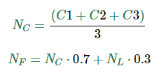

# Programas Simples
___

## ¿Qué nota necesito?

### Planteamiento
Un alumno desea saber que nota necesita en el tercer certamen para aprobar un ramo.

El promedio del ramo se calcula con la siguiente formula.

__<div align="center"></div>__

Donde _**NC**_ es el promedio de certámenes, _**NL**_ el promedio de laboratorio y _**NF**_ la nota final.

Escriba un programa que pregunte al usuario las notas de los dos primeros certamen y la nota de laboratorio, y muestre la nota que necesita el alumno para aprobar el ramo con nota final 60.

```
Ingrese nota certamen 1: 45
Ingrese nota certamen 2: 55
Ingrese nota laboratorio: 65
Necesita nota 72 en el certamen 3
```

### Solución